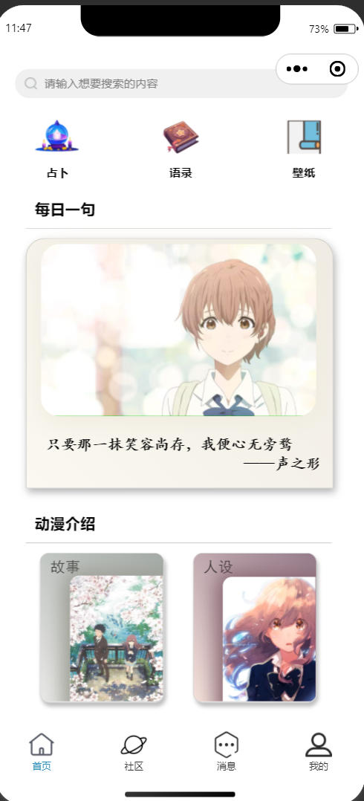
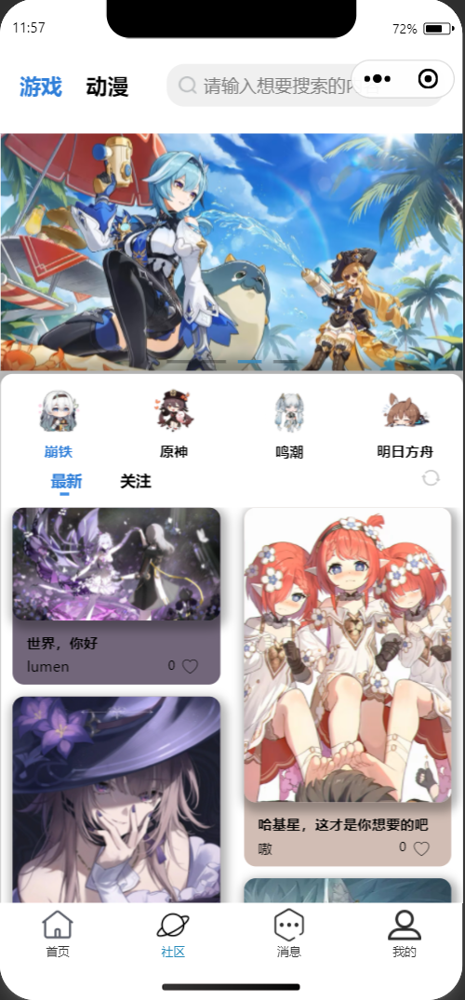
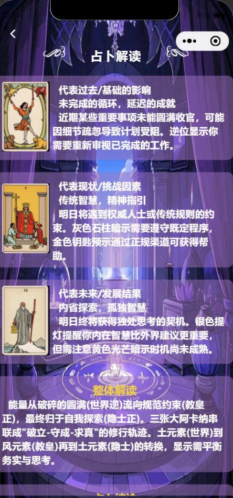
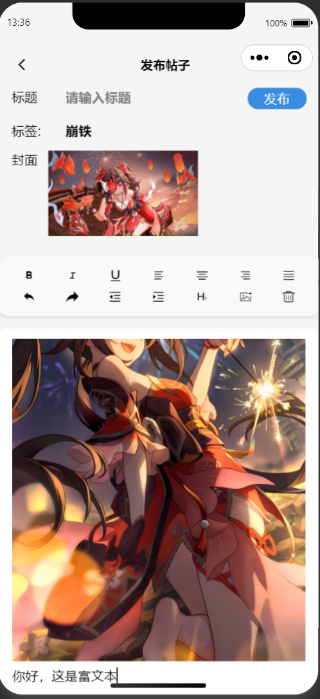
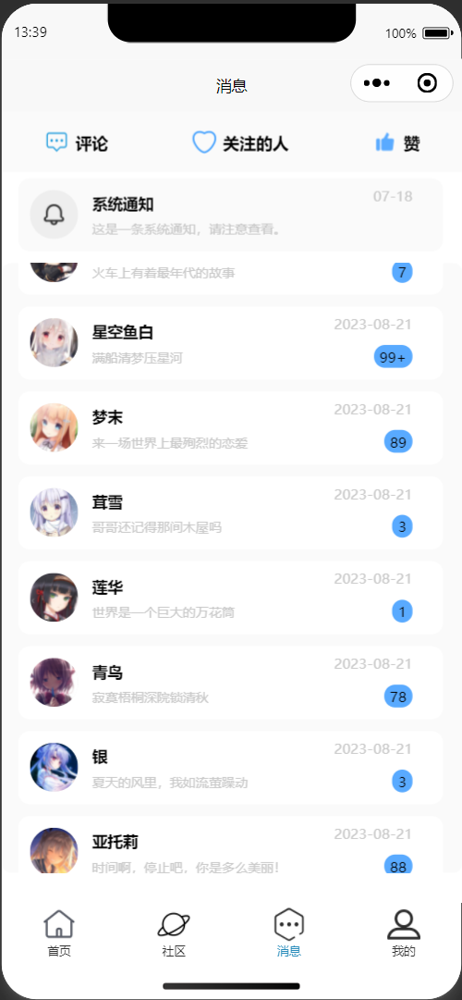

# 二次元微信小程序


## 项目介绍
本项目是一个使用vue3 + uni-app + ts 开发的微信小程序，主要功能包括：
- 登录/注册
- 用户信息编辑（头像上传、签名修改、昵称修改、背景修改）
- 文章/评论发布（支持富文本编辑）
- 基于deepseek进行的塔罗牌占卜

这是本人的第一个完全由个人实现的项目，在学习一段时间vue3和自学uni-app官方文档后的实践成果，希望对你有所帮助！


## 技术栈

- vue3
- uni-app
- typescript
- pinia
- uni-ui


## 开始使用

**1. 环境要求**

- Node.js(版本建议16.x以上)
- pnpm(需要使用pnpm进行依赖管理)

**2. 安装**

```
pnpm install
```

**3.运行项目**

```
pnpm dev:mp-weixin
```
此时会生成一个dist目录


**4.导入项目**
打开微信开发者工具，选择dist/dev/mp-weixin，导入项目，就能看到效果


## 使用说明

1. 在微信开发者工具中，预览微信小程序，大部分功能都要求账号注册
2. 想要体验项目的完整功能，需要搭配我的另一个uniapp_server项目使用（注意更换掉uniapp_server项目中的global.js中的服务器地址和本项目中stores/index.ts中的服务地址）

**index.ts**
```ts
export const useServerConfig = defineStore('server', () => {
  const ip = ref<string>('')  // 替换为你的服务器域名或ip
  const serverUrl = ref<string>(`http://${ip.value}:3000`)
  return { 
   ip,serverUrl
  }
})
```

**global.js**
```js
module.exports = {
    serverUrl:'', // 替换为你的服务器地址
    defaultAvatarImage:``, // 默认头像图片地址
    defaultBgImage:``,  // 默认背景图片地址
}
```


3. 如果想要使用占卜功能，需要在华为云上免费领取一个deepseek模型的APIKey,在uniapp_server项目中的utils/deepseek.js中的apiKey中填入自己的APIKey和选择的deepseek模型地址
```js
class DeepSeekChat {
    constructor() {
        this.url = ''; // 替换为你的模型地址
        this.apiKey = '';  // 替换为你的 API Key
        this.logFile = path.resolve(process.cwd(), 'static/chat_log.txt');
    }
}
```

4. 数据库需要使用到mysql,直接执行unipp_server项目中的sql脚本即可建库，然后在db/index.js填入你的数据库信息
```js
const db = mysql.createPool({
  host: 'localhost', // 替换为你的数据库主机地址
  user: 'root', // 替换为你的数据库用户名
  password: '', // 替换为你的数据库密码
  database:'uniapp'
})

module.exports = db;
```

## 预览

<div style='display:flex;justify-content:space-around;margin-bottom:20px'>



</div>

<div style='display:flex;justify-content:space-around'>



</div>


## 后续开发计划

- 开发用户之间的聊天功能
- 开发动漫语录推送功能
- 尝试多端适配


## 致谢
感谢Vue3、Uni-app和DeepSeek提供的技术支持！


